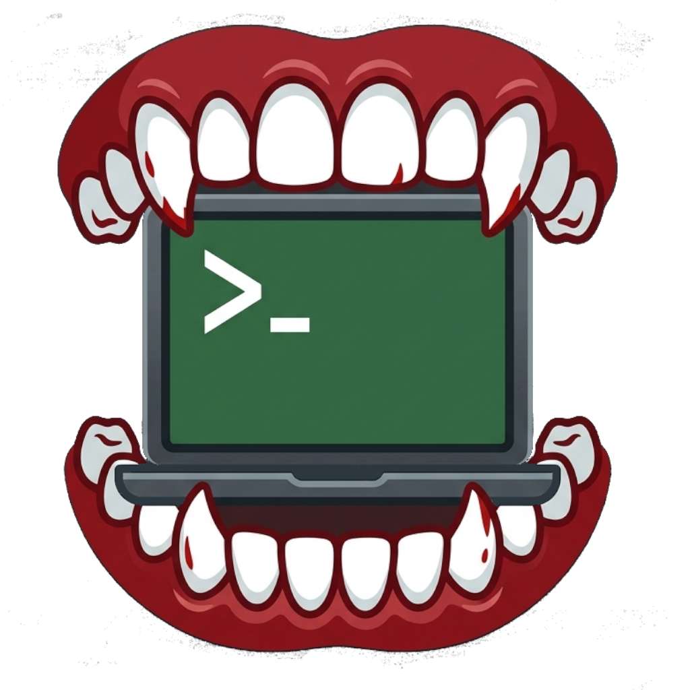

# Vectis

Hardware-accelerated Wayland/X11 terminal emulator written in modern C++20.

## Overview

Vectis is a lightweight Linux terminal emulator built on top of modern OpenGL and POSIX APIs. It focuses on low latency, native Wayland protocol integration, and minimal resource utilization.

## Architecture

- Language: C++20
- Graphics Backend: OpenGL 3.3 Core Profile (GLFW / libepoxy)
- Terminal Engine: libvterm (VT100 / VT220 / xterm compatibility)
- Text Rasterization: FreeType 2 with Fontconfig fallback resolution
- PTY Subsystem: UNIX98 pseudo-terminal (posix_openpt, non-blocking I/O)
- Event Loop: Linux kernel poll(2) with on-demand rendering (0.0% CPU usage when idle)

## Features

- Dynamic on-demand glyph atlas (2048x2048 VRAM cache)
- Multi-style typography: distinct font loading for Regular, Bold, Italic, and Bold-Italic faces
- Full UTF-8 support including Cyrillic, Box-Drawing characters, and Nerd Fonts
- 16-color ANSI palette fully configurable via configuration file
- SGR mouse tracking protocol support for interactive terminal applications (neovim, htop, mc)
- Safe URL detection and execution via xdg-open without shell interpolation
- Cell-bounded mouse text selection with Wayland clipboard integration
- Circular scrollback ring buffer (10,000 lines)
- Window title synchronization via OSC sequences
- Native compositor transparency support
- XDG-compliant configuration system (~/.config/vectis/vectis.conf)

## Keybindings

- Ctrl + Shift + C: Copy selection to clipboard
- Ctrl + Shift + V: Paste from clipboard
- Ctrl + Left Click: Open hovered URL in default browser
- Ctrl + Equal / Ctrl + Plus: Increase font size
- Ctrl + Minus: Decrease font size
- Ctrl + 0: Reset font size
- Shift + Mouse Drag: Force local selection inside mouse-aware applications

## Dependencies (Arch Linux)

- base-devel
- cmake
- ninja
- glfw-wayland
- libepoxy
- freetype2
- fontconfig
- libvterm
- pkgconf

## Build and Installation

    cmake -B build -G Ninja -DCMAKE_BUILD_TYPE=Release
    ninja -C build
    ./build/vectis

To install system-wide:

    sudo ninja -C build install

## Configuration

Configuration file location: ~/.config/vectis/vectis.conf

    font_family = JetBrains Mono
    font_size = 18
    window_width = 1024
    window_height = 720
    opacity = 0.90
    padding_x = 12
    padding_y = 12
    working_directory = inherit
    cursor_shape = beam
    cursor_blink = true

    background = #101216
    foreground = #e0e2e8
    cursor = #52adfa

    color0 = #15161e
    color1 = #f7768e
    color2 = #9ece6a
    color3 = #e0af68
    color4 = #7aa2f7
    color5 = #bb9af7
    color6 = #7dcfff
    color7 = #a9b1d6
    color8 = #414868
    color9 = #f7768e
    color10 = #9ece6a
    color11 = #e0af68
    color12 = #7aa2f7
    color13 = #bb9af7
    color14 = #7dcfff
    color15 = #c0caf5

## License

MIT License. Copyright (c) 2026 Dictor.
